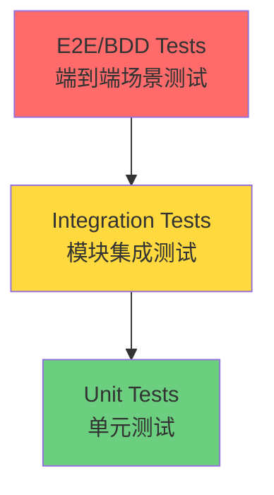

# Novel Studio 测试计划

> **项目**: Novel Studio - AI 驱动的小说创作工作室  
> **版本**: 0.1.0  
> **Python**: 3.12+  
> **测试框架**: pytest + pytest-asyncio + pytest-xdist + pytest-cov

---

## 📋 目录

- [测试策略概览](#测试策略概览)
- [测试工具配置](#测试工具配置)
- [测试分类与标记](#测试分类与标记)
- [模块测试计划](#模块测试计划)
- [覆盖率要求](#覆盖率要求)
- [测试执行指南](#测试执行指南)
- [最佳实践](#最佳实践)

---

## 测试策略概览

### 测试金字塔



### 测试层级划分

| 层级 | 占比目标 | 标记 | 说明 |
|------|---------|------|------|
| **单元测试** | 70% | `@pytest.mark.unit` | 测试单个函数/类的逻辑 |
| **集成测试** | 25% | `@pytest.mark.integration` | 测试模块间协作 |
| **BDD测试** | 5% | `@pytest.mark.bdd` | 业务场景验收测试 |

---

## 测试工具配置

### 已配置工具

根据 `pyproject.toml`，项目已配置以下测试工具:

#### 核心测试框架
- **pytest** (9.0.2+): 主测试框架
- **pytest-asyncio** (1.3.0+): 异步测试支持
- **pytest-xdist** (3.8.0+): 并行测试执行
- **pytest-cov** (6.0.0+): 代码覆盖率分析
- **pytest-mock** (3.14.0+): Mock 工具
- **pytest-bdd** (8.0.0+): BDD 行为驱动测试

#### 断言与快照工具
- **dirty-equals** (0.11+): 声明式断言（处理动态值）
- **inline-snapshot** (0.31.1+): 快照测试（自动更新预期值）

### pytest 配置要点

```toml
[tool.pytest.ini_options]
testpaths = ["tests"]              # 测试目录
python_files = "test_*.py"         # 测试文件模式
asyncio_mode = "auto"              # 自动检测异步测试
asyncio_default_fixture_loop_scope = "function"

addopts = [
    "-ra",                         # 显示所有测试结果摘要
    "-q",                          # 简洁输出
    "--tb=short",                  # 简短的 traceback
    "--strict-markers",            # 强制声明 markers
    "--strict-config",             # 严格配置检查
    "--cov=app",                   # 覆盖率检测 app 目录
    "--cov-report=term-missing",   # 显示未覆盖的行
    "--cov-report=html",           # 生成 HTML 报告
    "--cov-fail-under=70",         # 覆盖率低于 70% 失败
    "-n=auto",                     # 自动并行测试
]
```

---

## 测试分类与标记

### 自定义标记 (Markers)

```python
# 单元测试
@pytest.mark.unit
def test_parse_scene_blueprint():
    """测试场景蓝图解析逻辑"""
    pass

# 集成测试
@pytest.mark.integration
async def test_writing_engine_with_material_provider():
    """测试写作引擎与素材提供者的集成"""
    pass

# 慢速测试（可选择性跳过）
@pytest.mark.slow
async def test_full_chapter_generation():
    """完整章节生成测试（耗时较长）"""
    pass

# LLM 调用测试（需要真实 API）
@pytest.mark.llm
async def test_real_llm_generation():
    """真实 LLM 调用测试（产生费用）"""
    pass

# BDD 测试
@pytest.mark.bdd
def test_user_creates_novel_outline():
    """BDD: 用户创建小说大纲"""
    pass
```

### 测试选择执行

```bash
# 只运行单元测试
uv run pytest -m unit

# 跳过慢速测试
uv run pytest -m "not slow"

# 跳过 LLM 调用测试（避免费用）
uv run pytest -m "not llm"

# 只运行集成测试
uv run pytest -m integration

# 运行 BDD 测试
uv run pytest -m bdd
```

---

## 模块测试计划

### 1. Base 模块 (`app/modules/base/`)

**文件**: `context.py`, `prompt.py`, `schemas.py`

#### 测试重点
- ✅ Pydantic 模型验证
- ✅ 抽象类接口定义
- ✅ 基础数据结构序列化

#### 测试用例设计

```python
# tests/unit/test_base_schemas.py
import pytest
from app.modules.base.schemas import BaseSchema

@pytest.mark.unit
def test_base_schema_validation():
    """测试基础 Schema 的 Pydantic 验证"""
    # 测试必填字段
    # 测试类型校验
    # 测试默认值
    pass

@pytest.mark.unit
def test_base_context_initialization():
    """测试基础 Context 初始化"""
    pass
```

---

### 2. Materials 模块 (`app/modules/materials/`)

**核心文件**: `engine.py`, `chain.py`, `context.py`, `prompt.py`, `schemas.py`

#### 测试重点
- ✅ 文本分割逻辑 (`MaterialEngine.split_text`)
- ✅ 素材挖掘流程 (`MaterialEngine.mine`)
- ✅ LangChain 链构建
- ✅ 向量检索集成

#### 测试用例设计

```python
# tests/unit/test_materials_engine.py
import pytest
from app.modules.materials.engine import MaterialEngine
from app.modules.materials.context import MaterialsMiningContext

@pytest.mark.unit
def test_text_splitter():
    """测试文本分割器配置"""
    engine = MaterialEngine()
    text = "第一段。\n\n第二段。\n\n第三段。"
    chunks = engine.split_text(text)
    
    assert isinstance(chunks, list)
    assert all(isinstance(chunk, str) for chunk in chunks)
    assert len(chunks) > 0

@pytest.mark.integration
@pytest.mark.asyncio
async def test_material_mining_with_mock_llm():
    """测试素材挖掘（Mock LLM）"""
    # Mock LangChain LLM
    # 构建测试 Context
    # 验证返回的 ExtractedResult
    pass

@pytest.mark.llm
@pytest.mark.slow
@pytest.mark.asyncio
async def test_material_mining_real_llm():
    """测试真实 LLM 素材挖掘"""
    # 需要真实 API Key
    # 标记为 slow 和 llm，默认跳过
    pass
```

---

### 3. Writing 模块 (`app/modules/writing/`)

**核心文件**: `engine.py`, `chain.py`, `context.py`, `prompt.py`, `providers.py`, `schemas.py`

#### 测试重点
- ✅ 场景写作逻辑 (`WritingEngine.scene_writing`)
- ✅ 章节写作流程 (`WritingEngine.writing`)
- ✅ MaterialProvider 抽象实现
- ✅ 上下文构建与传递
- ✅ 异步并发处理

#### 测试用例设计

```python
# tests/unit/test_writing_engine.py
import pytest
from unittest.mock import AsyncMock, MagicMock
from app.modules.writing.engine import WritingEngine
from app.modules.writing.context import ChapterSceneWritingContext
from app.modules.writing.schemas import SceneChunk, Chapter

@pytest.mark.unit
@pytest.mark.asyncio
async def test_scene_writing_context_building():
    """测试场景写作上下文构建"""
    # 构建 Mock MaterialProvider
    mock_provider = MagicMock()
    engine = WritingEngine(material_provider=mock_provider)
    
    # 验证 Context 正确传递
    pass

@pytest.mark.integration
@pytest.mark.asyncio
async def test_chapter_writing_flow():
    """测试章节写作完整流程"""
    # Mock LLM 返回
    # Mock MaterialProvider
    # 验证多个 SceneChunk 聚合成 Chapter
    pass

@pytest.mark.unit
def test_material_provider_interface():
    """测试 MaterialProvider 接口定义"""
    from app.modules.writing.providers import MaterialProvider
    
    # 验证抽象方法存在
    assert hasattr(MaterialProvider, 'provide_materials_for_scene')
```

---

### 4. Outlines 模块 (`app/modules/outlines/`)

**子模块**: `bible/`, `chapter/`, `substory/`

#### 测试重点
- ✅ Bible 世界观生成
- ✅ Substory 子故事生成
- ✅ Chapter Blueprint 章节蓝图生成
- ✅ 三层级联生成流程

#### 测试用例设计

```python
# tests/unit/test_outlines_bible.py
import pytest
from app.modules.outlines.engines.bible import BibleEngine

@pytest.mark.unit
@pytest.mark.asyncio
async def test_bible_generation():
    """测试世界观生成引擎"""
    # Mock LLM
    # 验证 Bible Schema 输出
    pass

# tests/integration/test_outlines_cascade.py
@pytest.mark.integration
@pytest.mark.asyncio
async def test_bible_to_substory_cascade():
    """测试 Bible → Substory 级联生成"""
    # 验证上下文传递
    # 验证依赖关系
    pass
```

---

### 5. Post Writing 模块 (`app/modules/post_writing/`)

**核心文件**: `engine.py`, `chain.py`, `context.py`, `prompt.py`, `schemas.py`

#### 测试重点
- ✅ 后处理逻辑
- ✅ 文本润色
- ✅ 格式化输出

#### 测试用例设计

```python
# tests/unit/test_post_writing.py
import pytest
from app.modules.post_writing.engine import PostWritingEngine

@pytest.mark.unit
@pytest.mark.asyncio
async def test_text_polishing():
    """测试文本润色功能"""
    pass
```

---

### 6. 数据库与向量存储 (`app/db/`)

**文件**: `session.py`, `vector.py`

#### 测试重点
- ✅ SQLAlchemy 异步会话管理
- ✅ ChromaDB 向量存储操作
- ✅ 事务处理

#### 测试用例设计

```python
# tests/integration/test_database.py
import pytest
from app.db.session import get_async_session

@pytest.mark.integration
@pytest.mark.asyncio
async def test_async_session_lifecycle():
    """测试异步数据库会话生命周期"""
    async with get_async_session() as session:
        # 测试会话创建
        # 测试事务提交
        # 测试回滚
        pass

# tests/integration/test_vector_store.py
@pytest.mark.integration
@pytest.mark.asyncio
async def test_chroma_vector_operations():
    """测试 ChromaDB 向量操作"""
    # 测试向量插入
    # 测试相似度检索
    pass
```

---

### 7. 核心配置 (`app/core/`)

**文件**: `config.py`, `llm.py`

#### 测试重点
- ✅ 环境变量加载
- ✅ Pydantic Settings 验证
- ✅ LLM 客户端初始化

#### 测试用例设计

```python
# tests/unit/test_core_config.py
import pytest
from app.core.config import Settings

@pytest.mark.unit
def test_settings_validation():
    """测试配置验证"""
    # 测试必填字段
    # 测试默认值
    pass

@pytest.mark.unit
def test_llm_client_initialization():
    """测试 LLM 客户端初始化"""
    from app.core.llm import get_llm_client
    
    # Mock API Key
    # 验证客户端创建
    pass
```

---

## 覆盖率要求

### 全局覆盖率目标

根据 `pyproject.toml` 配置:

```toml
[tool.pytest.ini_options]
addopts = [
    "--cov=app",                   # 覆盖 app 目录
    "--cov-fail-under=70",         # 最低 70% 覆盖率
]

[tool.coverage.report]
precision = 2                      # 小数点精度
show_missing = true                # 显示未覆盖行
skip_covered = false               # 不跳过已覆盖文件
```

### 模块覆盖率目标

| 模块 | 目标覆盖率 | 优先级 |
|------|-----------|--------|
| `app/modules/base/` | 90%+ | 高 |
| `app/modules/materials/` | 80%+ | 高 |
| `app/modules/writing/` | 80%+ | 高 |
| `app/modules/outlines/` | 75%+ | 中 |
| `app/modules/post_writing/` | 75%+ | 中 |
| `app/db/` | 85%+ | 高 |
| `app/core/` | 90%+ | 高 |

### 覆盖率排除项

```toml
[tool.coverage.report]
exclude_lines = [
    "pragma: no cover",
    "def __repr__",
    "raise AssertionError",
    "raise NotImplementedError",
    "if __name__ == .__main__.:",
    "if TYPE_CHECKING:",
]
```

### 查看覆盖率报告

```bash
# 运行测试并生成覆盖率报告
uv run pytest

# 查看终端报告（显示未覆盖的行）
# 已自动配置 --cov-report=term-missing

# 查看 HTML 详细报告
open htmlcov/index.html  # macOS
xdg-open htmlcov/index.html  # Linux
```

---

## 测试执行指南

### 基础命令

```bash
# 运行所有测试（自动并行 + 覆盖率）
uv run pytest

# 运行指定目录
uv run pytest tests/unit/

# 运行指定文件
uv run pytest tests/unit/test_materials_engine.py

# 运行指定测试函数
uv run pytest tests/unit/test_materials_engine.py::test_text_splitter

# 详细输出模式
uv run pytest -v

# 显示打印输出
uv run pytest -s
```

### 高级用法

```bash
# 只运行失败的测试
uv run pytest --lf

# 先运行失败的测试，再运行其他
uv run pytest --ff

# 停止在第一个失败
uv run pytest -x

# 停止在第 N 个失败
uv run pytest --maxfail=3

# 禁用并行（调试时使用）
uv run pytest -n=0

# 更新 inline-snapshot
uv run pytest --inline-snapshot=fix
```

### 覆盖率专项

```bash
# 只生成覆盖率，不显示测试输出
uv run pytest --quiet --cov=app

# 只生成 HTML 报告
uv run pytest --cov=app --cov-report=html --cov-report=

# 查看特定模块覆盖率
uv run pytest --cov=app.modules.writing --cov-report=term-missing
```

---

## 最佳实践

### 1. 异步测试规范

```python
import pytest

# ✅ 正确：使用 @pytest.mark.asyncio
@pytest.mark.asyncio
async def test_async_function():
    result = await some_async_function()
    assert result is not None

# ❌ 错误：忘记标记
async def test_async_function_wrong():
    # 这会失败！
    result = await some_async_function()
```

### 2. Mock LLM 调用

```python
from unittest.mock import AsyncMock, patch

@pytest.mark.unit
@pytest.mark.asyncio
async def test_with_mocked_llm():
    """Mock LangChain LLM 调用"""
    mock_response = {"content": "生成的文本"}
    
    with patch('app.modules.writing.chain.get_scene_writing_chain') as mock_chain:
        mock_chain.return_value.ainvoke = AsyncMock(return_value=mock_response)
        
        # 执行测试
        result = await engine.scene_writing(context)
        assert result["content"] == "生成的文本"
```

### 3. 使用 dirty-equals 处理动态值

```python
from dirty_equals import IsUUID, IsInt, IsStr, IsNow

@pytest.mark.unit
def test_with_dirty_equals():
    """处理 UUID、时间戳等动态值"""
    data = {
        "id": "550e8400-e29b-41d4-a716-446655440000",
        "created_at": "2024-01-01T00:00:00Z",
        "count": 42,
    }
    
    assert data == {
        "id": IsUUID(4),           # 验证 UUID v4 格式
        "created_at": IsNow(delta=60),  # 验证时间戳在 60 秒内
        "count": IsInt(gt=40),     # 验证整数大于 40
    }
```

### 4. 使用 inline-snapshot 快照测试

```python
from inline_snapshot import snapshot

@pytest.mark.unit
def test_with_snapshot():
    """快照测试：自动捕获预期输出"""
    result = generate_complex_structure()
    
    # 第一次运行时 snapshot() 为空
    # 运行 pytest --inline-snapshot=fix 自动填充
    assert result == snapshot({
        "title": "示例标题",
        "chapters": [
            {"id": 1, "name": "第一章"},
            {"id": 2, "name": "第二章"},
        ]
    })
```

### 5. Fixture 复用

```python
# tests/conftest.py
import pytest
from app.modules.writing.engine import WritingEngine
from unittest.mock import MagicMock

@pytest.fixture
def mock_material_provider():
    """Mock MaterialProvider Fixture"""
    provider = MagicMock()
    provider.provide_materials_for_scene = AsyncMock(return_value=[])
    return provider

@pytest.fixture
def writing_engine(mock_material_provider):
    """WritingEngine Fixture"""
    return WritingEngine(material_provider=mock_material_provider)

# tests/unit/test_writing.py
@pytest.mark.unit
def test_with_fixture(writing_engine):
    """使用 Fixture 简化测试"""
    assert writing_engine is not None
```

### 6. 参数化测试

```python
@pytest.mark.parametrize("input_text,expected_chunks", [
    ("短文本", 1),
    ("中等长度的文本" * 50, 2),
    ("很长的文本" * 200, 5),
])
@pytest.mark.unit
def test_text_splitting_parametrized(input_text, expected_chunks):
    """参数化测试：多组输入"""
    engine = MaterialEngine()
    chunks = engine.split_text(input_text)
    assert len(chunks) >= expected_chunks
```

### 7. BDD 测试示例

```gherkin
# tests/bdd/features/novel_creation.feature
Feature: 小说创作流程
  作为一个作者
  我想要使用 AI 生成小说大纲和正文
  以便快速完成创作

  Scenario: 生成小说世界观
    Given 我提供了小说主题 "科幻冒险"
    When 系统生成世界观
    Then 我应该收到包含背景设定的 Bible 对象
    And Bible 应该包含至少 3 个关键设定
```

```python
# tests/bdd/test_novel_creation.py
import pytest
from pytest_bdd import scenarios, given, when, then

scenarios('features/novel_creation.feature')

@given('我提供了小说主题 "科幻冒险"')
def novel_theme():
    return "科幻冒险"

@when('系统生成世界观')
async def generate_bible(novel_theme):
    # 调用 BibleEngine
    pass

@then('我应该收到包含背景设定的 Bible 对象')
def verify_bible(bible):
    assert bible is not None
```

---

## 测试目录结构

```
tests/
├── conftest.py                    # 全局 Fixtures
├── test_demo.py                   # 示例测试（已存在）
│
├── unit/                          # 单元测试
│   ├── test_base_schemas.py
│   ├── test_materials_engine.py
│   ├── test_writing_engine.py
│   ├── test_outlines_bible.py
│   ├── test_outlines_chapter.py
│   ├── test_outlines_substory.py
│   ├── test_post_writing.py
│   └── test_core_config.py
│
├── integration/                   # 集成测试
│   ├── test_database.py
│   ├── test_vector_store.py
│   ├── test_writing_flow.py
│   ├── test_outlines_cascade.py
│   └── test_materials_integration.py
│
└── bdd/                           # BDD 测试
    ├── features/
    │   ├── novel_creation.feature
    │   └── material_mining.feature
    └── test_novel_creation.py
```

---

## 实施路线图

### Phase 1: 基础设施 (Week 1)
- [ ] 创建 `tests/conftest.py` 全局配置
- [ ] 编写 Mock LLM Fixtures
- [ ] 编写数据库测试 Fixtures
- [ ] 验证 pytest 配置正确性

### Phase 2: 单元测试 (Week 2-3)
- [ ] Base 模块单元测试 (90%+ 覆盖率)
- [ ] Core 模块单元测试 (90%+ 覆盖率)
- [ ] Materials 模块单元测试 (80%+ 覆盖率)
- [ ] Writing 模块单元测试 (80%+ 覆盖率)

### Phase 3: 集成测试 (Week 4)
- [ ] 数据库集成测试
- [ ] 向量存储集成测试
- [ ] 模块间协作测试
- [ ] 端到端流程测试

### Phase 4: BDD 测试 (Week 5)
- [ ] 编写 Feature 文件
- [ ] 实现 Step Definitions
- [ ] 业务场景验收测试

### Phase 5: 持续优化 (Ongoing)
- [ ] 提升覆盖率至 80%+
- [ ] 性能测试
- [ ] 压力测试
- [ ] 回归测试自动化

---

## 附录

### A. 常用命令速查

```bash
# 快速运行所有测试
uv run pytest

# 只运行单元测试（快速反馈）
uv run pytest -m unit

# 跳过慢速和 LLM 测试（CI 环境）
uv run pytest -m "not slow and not llm"

# 调试单个测试
uv run pytest tests/unit/test_materials_engine.py::test_text_splitter -v -s

# 更新快照
uv run pytest --inline-snapshot=fix

# 查看覆盖率报告
uv run pytest && open htmlcov/index.html
```

### B. 环境变量配置

```bash
# .env.test (测试环境配置)
OPENAI_API_KEY=sk-test-mock-key
DATABASE_URL=sqlite+aiosqlite:///./test.db
CHROMA_PERSIST_DIR=./test_chroma_db
```

### C. CI/CD 集成示例

```yaml
# .github/workflows/test.yml
name: Tests

on: [push, pull_request]

jobs:
  test:
    runs-on: ubuntu-latest
    steps:
      - uses: actions/checkout@v3
      - uses: actions/setup-python@v4
        with:
          python-version: '3.12'
      
      - name: Install uv
        run: pip install uv
      
      - name: Install dependencies
        run: uv sync
      
      - name: Run tests
        run: uv run pytest -m "not slow and not llm"
      
      - name: Upload coverage
        uses: codecov/codecov-action@v3
```

---

**文档版本**: 1.0  
**最后更新**: 2026-02-08  
**维护者**: Novel Studio Team
